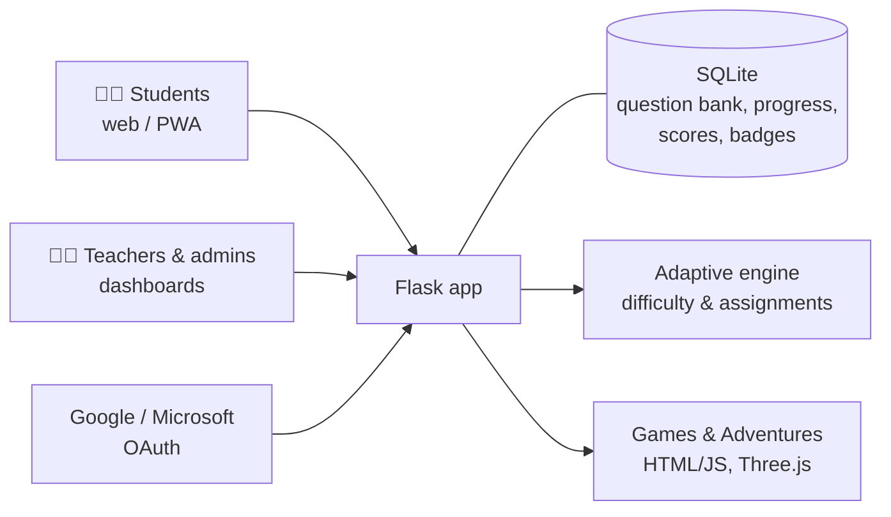

# 🕵️ AgentMath

**An adaptive, game-based maths platform for Irish Junior Cycle students, built by a maths teacher for real classrooms.**

🔗 **Live:** [www.agentmath.app](https://www.agentmath.app)
🔒 *Source code is private. I'm happy to walk through it in an interview.*

> *"Become a Math Detective: Solve the Mystery of Numbers!"*

---

## The problem

In a mixed-ability maths class, one worksheet never fits everyone. Some students are bored, others are lost, and the teacher has little real-time insight into who needs help with what. Many learning platforms are also generic: they aren't aligned to the Irish Junior Cycle, and they ask children to hand over personal data just to get started.

I built AgentMath while teaching Junior Cycle maths, to give every student practice at the right level and to give me, as the teacher, a clear view of where each student and the class were struggling.

## What it does

- 📚 **3,000+ curriculum-aligned assessment items** across **14+ Junior Cycle topics**
- 🎯 **Adaptive progression:** assignments and difficulty adjust to each student's performance, with competency-based pathways through each topic
- 📊 **Teacher and admin dashboards** that surface performance data, identify knowledge gaps across a class, and support personalised assignments
- 🏆 **Gamification that keeps students coming back:** badges, avatars, leaderboards and a *Points for Prizes* reward system
- 🌍 **Real Life Adventures:** maths in context, such as scattergraphs and correlation, statistics, and a multi-week *Soccer Owner Journey* where students build a pitch, analyse data and plan match strategy
- 🎮 **Classroom games and lesson packs**, including station-based activities, Parkrun histograms, a Z-score sprint lab and expected value
- 🏛️ ***Agent of the Lost Numbers*:** a 3D, first-person history-of-maths adventure built in Three.js, with a procedurally generated maze, a room-by-room journey from Mesopotamia to Egypt, and puzzles to solve

## Designed for schools and for children's privacy

- **Three ways in:** *Quick Try* (no registration at all), **anonymous guest codes** (such as `panda42`, so progress is tracked without collecting a name or email), or **Google / Microsoft sign-in** using existing school accounts
- **Guest-to-account progress transfer**, so nothing is lost when a student later signs in properly
- **Installable web app (PWA):** scan a QR code to add it to the home screen on iOS or Android, with no app store needed

## Architecture

## Tech stack

| Area | Technologies |
|---|---|
| Backend | Python, Flask |
| Data | SQLite: question bank, student progress, performance analytics |
| Front end | HTML, CSS, JavaScript, Three.js (3D module) |
| Identity | Google OAuth, Microsoft OAuth (Azure app registration), anonymous guest codes |
| Delivery | Progressive Web App, PythonAnywhere hosting, GitHub |
| Development | AI-assisted development with Claude |

## What this project demonstrates

- **Domain expertise turned into software:** designed by someone who teaches the curriculum, and tested with real students
- **Data-driven design:** performance data drives both the student experience (adaptive difficulty) and the teacher's decisions (gap analysis)
- **Privacy-conscious design for children:** students can use the platform fully without giving any personal data
- **Breadth:** from a relational question bank and dashboards to a 3D browser game
- **Iterative delivery:** built and improved continuously over several years, based on classroom feedback

---

*Built by [Barry Sisk](https://github.com/BBSISK) · Higher Diploma in Software Development, Maynooth University*
